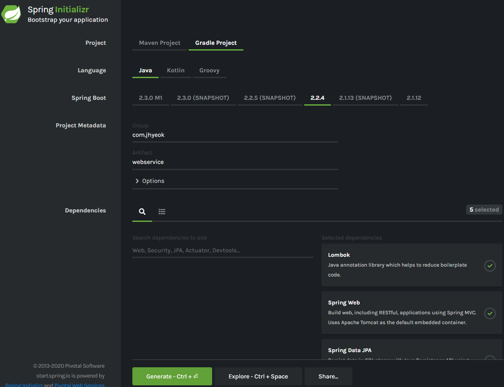
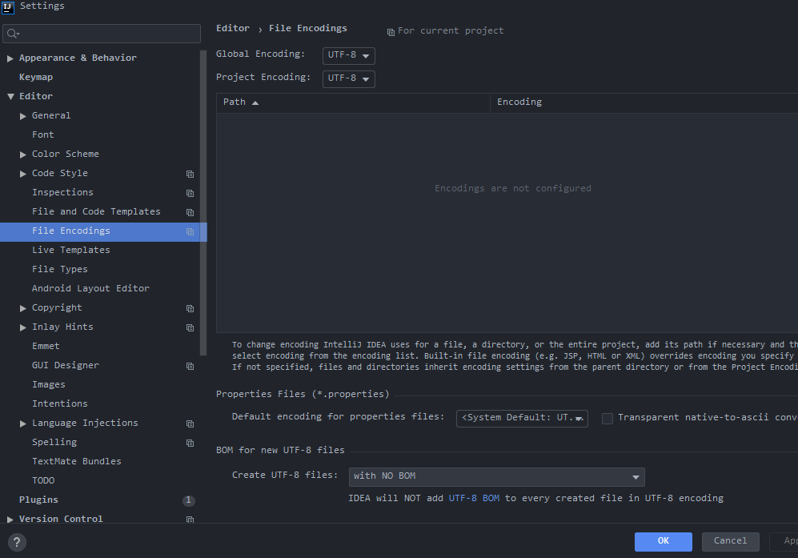
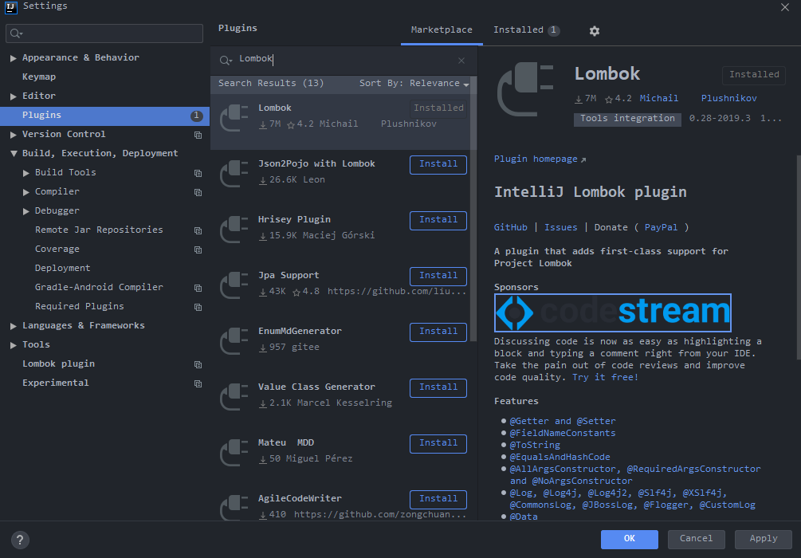
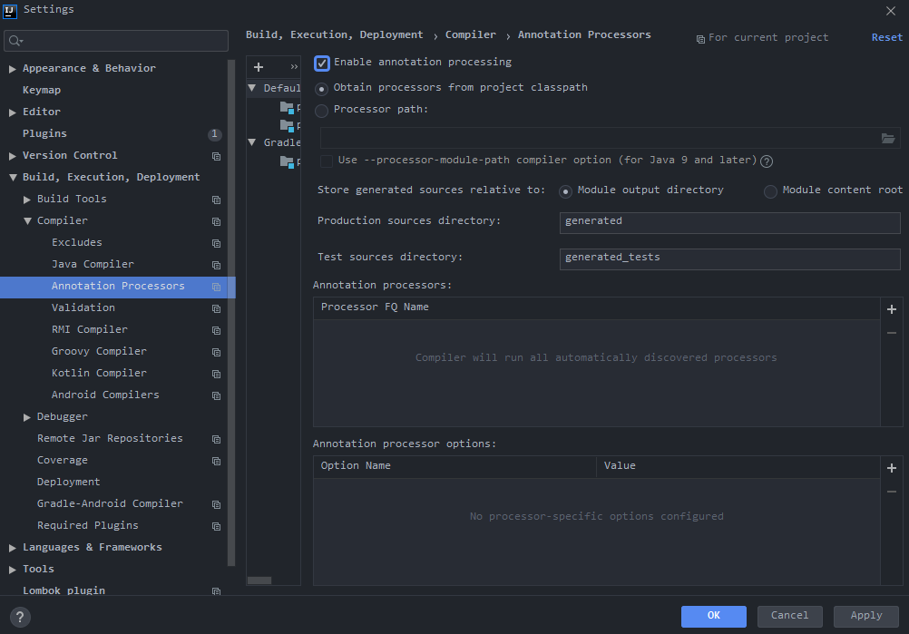

# Spring Boot 시작하기

#### 01. 시작하기

01. [AdoptOpenJDK](https://adoptopenjdk.net/index.html) 설치
02. https://start.spring.io/ 에 접속해서 Language, Spring Boot, Project Metadata, Dependencies 등을 설정한 이후에 Generate버튼을 클릭해서 알집 파일을 다운로드한다.
03. 다운로드한 알집 파일의 압축을 풀고, IntelliJ IDEA Community에서 열면 된다.

- 현재 사용하고 있는 IntelliJ IDEA Community에서 프로젝트를 처음 시작할 때, Spring Initializr가 보이지 않아서 이 방법으로 진행했다.

#### 02. 한글 인코딩 관련

**콘솔창 한글 설정**
01. `IntelliJ - Help → Edit Custom VM Options...`메뉴를 선택한다.
02. `-Dfile.encoding=UTF-8`을 추가해준다.

**Editor File Encoding 설정**
01. `File > Settings > Editor > File Encodings`에서 아래 사진처럼 Global/Project Encoding을 UTF-8로 설정한다.

#### 03. Lombok 설정

01. `File > Settings > Plugins`에서 `Lombok`을 설치한다.

02. `File > Settings > Build > Compiler > Annotation Processors`에서 `Enable annotation processing`를 체크한다.
