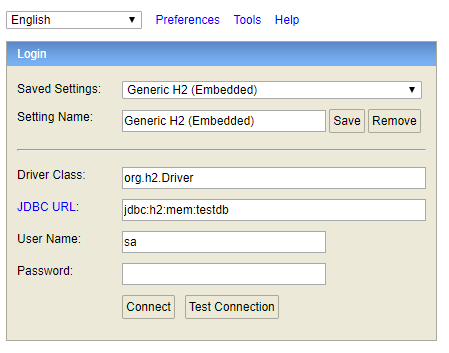

# Spring Boot 시작하기

#### 01. 시작하기

01. [AdoptOpenJDK](https://adoptopenjdk.net/index.html) 설치
02. https://start.spring.io/ 에 접속해서 Language, Spring Boot, Project Metadata, Dependencies 등을 설정한 이후에 Generate버튼을 클릭해서 알집 파일을 다운로드한다.
03. 다운로드한 알집 파일의 압축을 풀고, IntelliJ IDEA Community에서 열면 된다.

- 현재 사용하고 있는 IntelliJ IDEA Community에서 프로젝트를 처음 시작할 때, Spring Initializr가 보이지 않아서 이 방법으로 진행했다.

#### 02. 한글 인코딩 관련

**콘솔창 한글 설정**
01. `IntelliJ - Help → Edit Custom VM Options...`메뉴를 선택한다.
02. `-Dfile.encoding=UTF-8`을 추가해준다.

**Editor File Encoding 설정**
01. `File > Settings > Editor > File Encodings`에서 아래 사진처럼 Global/Project Encoding을 UTF-8로 설정한다.


#### 03. Lombok 설정

01. `File > Settings > Plugins`에서 `Lombok`을 설치한다.

02. `File > Settings > Build > Compiler > Annotation Processors`에서 `Enable annotation processing`를 체크한다.


#### 04. H2 데이터베이스 설정

01. H2 데이터베이스를 먼저 다운로드 받는다. `C:\Program Files (x86)\H2`에서 `build.sh`를 한 번 실행시켜준다.

02. `src/main/resources/application.yml`을 수정한다.
    ```yaml
    spring:
      h2:
        console:
          enabled: true
    ```
03. `Application.java`를 실행시키고 `http://localhost:8080/h2-console`에 접속을 한다.

    |Value|Setting|
    |:---:|:---:|
    |Driver Class|org.h2.Driver|
    |JDBC URL|jdbc:h2:mem:testdb|
    |User Name|sa|
    |Password|<blank>|


Connect를 하면 정상적으로 H2 데이터베이스에 접속된다.

Postman을 실행해서 아래 처럼 요청을 하면 데이터가 입력된다.

```
POST http://localhost:8080/article
Body raw
{
    "title": "테스트 내용입니다.",
    "content": "테스트 컨텐츠입니다.",
    "author": "김재혁"
}
```

